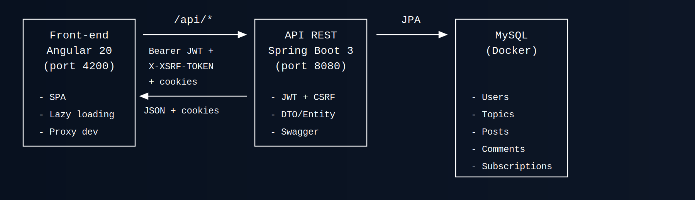
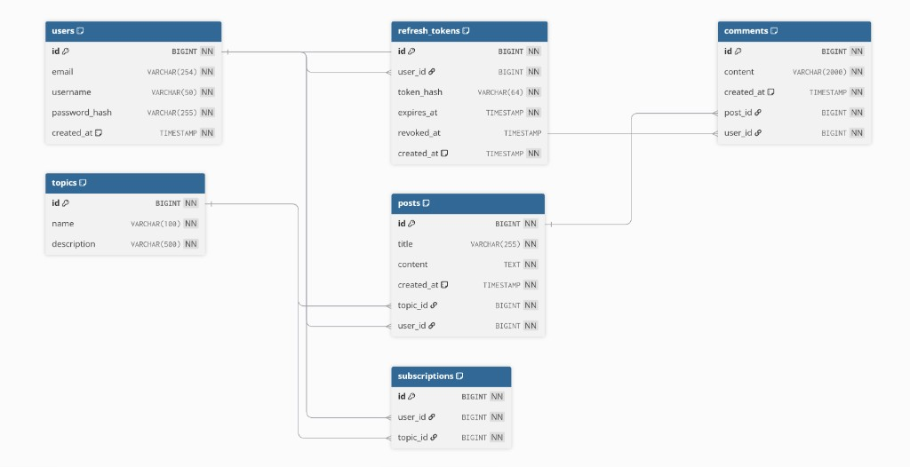
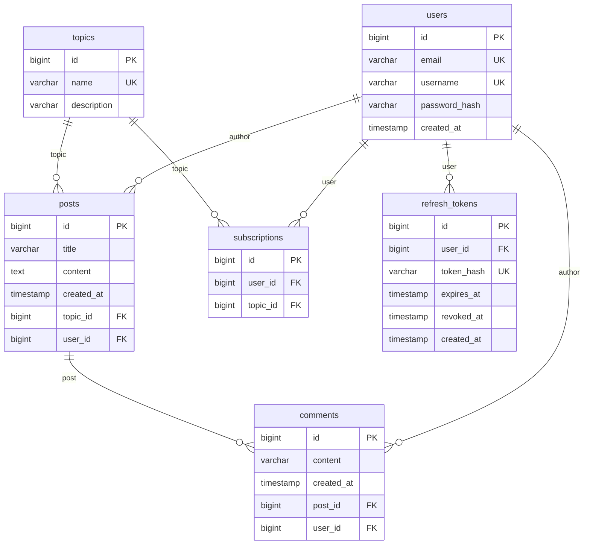

# Justification des choix techniques — MDD

**Auteur :** Ghazi Bouzazi  
**Version :** 1.0.0  
**Date :** 13/03/2026  

Ce document complète le **template de justification des choix techniques** fourni dans le cadre de la mission P5 Option B *« Prenez en charge le développement d'une application full-stack complète »*. Il s'appuie sur les **spécifications fonctionnelles** et les **contraintes techniques** du projet MDD fournis par ORION.

### Livrables P5 (référence)

| Livrable | Où dans le repo / la doc |
|----------|---------------------------|
| **Repo GitHub** | Dépôt du projet (front + back + docs) |
| Architecture et code front-end | `front/` — structure par features, Angular, composants standalone |
| Architecture back-end et code back-end avec données sécurisées | `back/` — Spring Boot, JWT, refresh token HttpOnly, CSRF |
| Code de l'application et code des tests | `front/`, `back/`, `back/src/test/`, `front/cypress/`, tests Karma |
| Instructions pour exécuter les tests | `README.md`, `back/README.md`, `front/README.md` (commandes `mvn test`, `npm run test`, `npm run e2e`) |
| Code refactorisé / conventions internes | Architecture par domaine (back), par features (front), DTOs, gestion centralisée des erreurs |
| README technique et configuration | `README.md` (racine), `back/README.md`, `front/README.md` — quickstart, ports, prérequis |
| **Documentation et annexes** | Ce document + `docs/` |
| Captures d'écran de l'UI | [captures-ui.md](captures-ui.md) — page d’affichage ; fichiers dans `docs/UI/` |
| Analyse des besoins front-end | Spécifications fonctionnelles, maquettes Figma ; section 1 et 2 de ce document |
| Définition des données | `docs/api-contract.md`, section 2.3 de ce document, entités JPA (User, Topic, Post, Comment, Subscription) |
| Rapport de couverture et de tests | JaCoCo (back), Istanbul/NYC (front) — rapports à joindre ; section 3.1 de ce document |
| Rapport de revue technique | Section 3.3 de ce document (points forts, axes d'amélioration, actions correctives) |
| FAQ utilisateur | `docs/faq-utilisateur.md` + section 4.1 de ce document |

---

## 1. Présentation générale du projet

### 1.1 Objectifs du projet

MDD (**Monde de Dév**) est le réseau social dédié aux développeurs porté par ORION (version MVP) : s'abonner à des sujets (Java, Angular, etc.), consulter un fil d'actualité chronologique, écrire des articles et poster des commentaires. Référence : [Spécifications fonctionnelles](https://course.oc-static.com/projects/D%C3%A9v_Full-Stack/D%C3%A9veloppez+une+application+Full-Stack+compl%C3%A8te/Spe%CC%81cifications+fonctionnelles.pdf).

- **But** : Tester le réseau en interne avec une version minimale (MVP).
- **Besoins métiers** : Gestion des utilisateurs (inscription, connexion persistante, profil) ; abonnements aux thèmes ; articles (fil, tri, création, détail, commentaires).
- **Contexte** : Formation OpenClassrooms. Respect des [contraintes techniques](https://course.oc-static.com/projects/D%C3%A9v_Full-Stack/D%C3%A9veloppez+une+application+Full-Stack+compl%C3%A8te/Contraintes+techniques.pdf) : Java/Spring, TypeScript/Angular, un seul dépôt Git, API sécurisée.

### 1.2 Périmètre fonctionnel

Périmètre aligné sur les **spécifications fonctionnelles** (liste des fonctionnalités à implémenter pour le MVP, sans back-office). État des livrables :

| Fonctionnalité | Description | Statut |
|----------------|-------------|--------|
| Accès formulaire connexion / inscription | Page d'accueil (non connectée) | Terminé |
| Création de compte | Inscription avec e-mail, mot de passe, nom d'utilisateur ; mot de passe ≥ 8 car., avec chiffre, minuscule, majuscule, caractère spécial | Terminé |
| Connexion | Connexion par e-mail ou nom d'utilisateur + mot de passe ; **persistance de la session** (refresh token) | Terminé |
| Déconnexion | Se déconnecter | Terminé |
| Profil | Consulter (e-mail, nom d'utilisateur, abonnements) et modifier (e-mail, nom d'utilisateur, mot de passe) via page profil | Terminé |
| Liste des thèmes | Consulter tous les thèmes (abonné ou non) via page dédiée | Terminé |
| Abonnement / désabonnement | S'abonner à un thème (page thèmes) ; se désabonner (page profil) | Terminé |
| Fil d'actualité | Consulter le fil par chronologie (plus récent → plus ancien), tri asc/desc, filtre par thème | Terminé |
| Ajout d'article | Choisir le thème, titre et contenu ; auteur et date définis automatiquement | Terminé |
| Consultation d'article | Thème, titre, auteur, date, contenu, commentaires | Terminé |
| Commentaires | Ajouter un commentaire (contenu) ; auteur et date automatiques ; pas de sous-commentaires | Terminé |
| Responsive | Écrans adaptés mobile et ordinateur | Terminé |

---

## 2. Architecture et conception technique

### 2.1 Schéma global de l'architecture

*Front-end Angular 20 (port 4200) ↔ API REST Spring Boot 3 (port 8080) via /api/* (Bearer JWT, X-XSRF-TOKEN, cookies) ; API ↔ MySQL (Docker) via JPA.*

**Choix d'organisation :**

- **Mono-repo** : `front/`, `back/`, `docs/` dans un seul dépôt.
- **Back-end** : Architecture par domaine (auth, user, topic, subscription, feed, post, comment) avec couches controller / service / dto / entity / repository.
- **Front-end** : Structure par features (auth, feed, topics, profile, posts) ; composants standalone, lazy loading des routes, auth-shell pour le layout authentifié.
- **Outils** : Docker pour MySQL en dev ; Testcontainers pour les tests d’intégration ; Swagger/OpenAPI pour la doc runtime.

### 2.2 Choix techniques

Les choix respectent les **contraintes techniques** ORION : back-end Java/Spring (Spring Core obligatoire, Spring Boot recommandé, modules Spring privilégiés), front-end TypeScript/Angular, un seul dépôt Git, API sécurisée entre front et back, principes SOLID.

| Éléments choisis | Type | Lien documentation | Objectif du choix | Justification |
|------------------|------|--------------------|-------------------|---------------|
| Angular 20 | Framework front-end | https://angular.dev | Structuration SPA, composants, réactivité | Standard du parcours, cohérence avec maquettes Figma, standalone components |
| Spring Boot 3 | Framework back-end | https://spring.io/projects/spring-boot | API REST, sécurité, JPA | Écosystème mature, intégration JWT, validation, tests |
| Java 17 | Langage back-end | - | Exécution du serveur | Compatible Spring Boot 3, LTS |
| MySQL | Base de données | - | Persistance (users, topics, posts, comments, subscriptions) | Docker simple pour dev, Testcontainers pour tests |
| JWT + Refresh Token | Authentification | - | Authentification stateless, session persistante | JWT pour API stateless ; refresh token en cookie HttpOnly pour sécurité (pas de stockage JWT côté client) |
| Angular Material | UI / composants | https://material.angular.io | Toolbar, formulaires, boutons | Cohérence visuelle, accessibilité, alignement avec maquettes |
| JUnit 5 + MockMvc | Tests back | - | Tests unitaires et intégration | Standard Java, MockMvc pour endpoints REST |
| Testcontainers | Tests back | - | Tests d'intégration avec MySQL réel | Fiabilité des tests sans mock DB |
| Karma / Jasmine | Tests unitaires front | - | Tests des composants et services | Framework par défaut Angular |
| Cypress | Tests E2E | - | Parcours complets (register, login, feed, posts, etc.) | Automatisation de scénarios utilisateur |
| JaCoCo | Couverture back | - | Rapport de couverture Java | Intégré Maven, rapport HTML/XML |
| Istanbul / NYC | Couverture front | - | Couverture des tests unitaires et E2E | Intégré au build Angular et Cypress |
| Swagger / OpenAPI | Documentation API | - | Doc runtime sur /swagger-ui.html | Conception contract-first, exploration des endpoints |

### 2.3 API et schémas de données

**Principaux endpoints :**

| Endpoint | Méthode | Description | Corps / Réponse |
|----------|---------|-------------|-----------------|
| /api/auth/csrf | GET | Initialise le cookie CSRF | 204 No Content |
| /api/auth/register | POST | Inscription | JSON RegisterRequest → { id } |
| /api/auth/login | POST | Connexion | JSON LoginRequest → TokenResponse (accessToken, tokenType, expiresInSeconds) |
| /api/auth/refresh | POST | Renouvelle l'access token | Cookie refreshToken → TokenResponse |
| /api/auth/logout | POST | Déconnexion | 204 No Content |
| /api/users/me | GET | Profil utilisateur courant | UserMeResponse |
| /api/users/me | PUT | Mise à jour profil | UpdateMeRequest → UpdatedResponse |
| /api/users/me/subscriptions | POST | S'abonner à un topic | SubscribeRequest → { id } |
| /api/users/me/subscriptions/{topicId} | DELETE | Se désabonner | 204 No Content |
| /api/topics | GET | Liste des topics | TopicListItemDto[] |
| /api/feed | GET | Fil d'actualité (order, topicId) | FeedItemDto[] |
| /api/posts | POST | Créer un article | CreatePostRequest → { id } |
| /api/posts/{postId} | GET | Détail d'un article | PostDetailResponse |
| /api/posts/{postId}/comments | POST | Créer un commentaire | CreateCommentRequest → { id } |

**Schémas principaux :**

- **User** : id, email, username, password (hashé), createdAt  
- **Topic** : id, name, description  
- **Post** : id, topicId, authorId, title, content, createdAt  
- **Comment** : id, postId, authorId, content, createdAt  
- **Subscription** : userId, topicId  

**Relations :** User 1-N Post, User 1-N Comment ; Topic 1-N Post ; Post 1-N Comment ; User N-N Topic (via Subscription).

#### Schéma relationnel

Schéma UML des tables et relations (users, topics, posts, comments, subscriptions, refresh_tokens) :

*Diagramme Mermaid (équivalent) et script SQL ci-dessous.*

**Script SQL :** [docs/schema-relationnel-mdd.sql](schema-relationnel-mdd.sql) — création des tables `users`, `topics`, `posts`, `comments`, `subscriptions`, `refresh_tokens` avec contraintes et index (MySQL 8).

Voir `docs/api-contract.md` pour les payloads complets et le format d'erreur unifié (ApiErrorResponse).

---

## 3. Tests, performance et qualité

### 3.1 Stratégie de test

| Type de test | Outil / framework | Portée | Résultats |
|--------------|-------------------|--------|-----------|
| Test unitaire (back) | JUnit 5, Mockito | Services (AuthService, JwtService, RefreshTokenService, UserService, TopicService, FeedService, SubscriptionService, PostService, CommentService), validation (PasswordPolicy), gestion erreurs (RestExceptionHandler) | Tests passants, couverture JaCoCo |
| Test d'intégration (back) | JUnit 5, MockMvc, Testcontainers (MySQL) | AuthFlow, FeedController, TopicController, SubscriptionController, PostController, CommentController, UserMe | Contrôles end-to-end des endpoints |
| Test unitaire (front) | Jasmine / Karma | auth.store, auth.facade, auth.interceptor, auth.guards, services API, composants (login, register, feed, topics, profile, posts) | Tests passants |
| Test E2E | Cypress | Inscription, login, abonnements, feed, création post, commentaire, profil, refresh 401, logout | Scénarios complets validés |

### 3.2 Rapport de performance et optimisation

- **API** : Stateless, endpoints simples, requêtes JPA optimisées (relations appropriées) ; pas de N+1 visible.
- **Front** : Lazy loading des modules Angular pour réduire le bundle initial ; access token en mémoire (pas de localStorage) pour limiter les risques XSS.
- **Build** : `ng build -c production` pour le front ; possibilité d’audit Lighthouse sur le build prod via `npm run prod`.
- **Audit** : Pas d’audit Lighthouse/SonarQube documenté dans le MVP ; la structure (modularité, lazy loading) est conçue pour de bonnes performances.

Exemple de formulation possible : *« La performance du front est optimisée grâce au lazy loading des modules Angular et à un build de production. L’API REST stateless et les relations JPA adaptées limitent les requêtes redondantes. »*

### 3.3 Revue technique

**Points forts :**
- Modularité des services Spring par domaine (auth, user, topic, feed, post, comment).
- DTOs dédiés pour ne pas exposer les entités JPA.
- Gestion centralisée des erreurs (RestExceptionHandler).
- Architecture front par features, composants standalone.
- Gestion de l’auth cohérente (JWT + refresh cookie HttpOnly, pas de JWT côté client).

**Points à améliorer :**
- Possibilité de factoriser certaines validations ou logiques partagées entre contrôleurs.
- Couverture de tests : viser une couverture plus élevée sur les branches métier complexes.

**Actions correctives appliquées :**
- Refactorisation du back vers une structure controller/service/entity/repository/dto par domaine.
- Simplification de la gestion des tokens côté front (suppression du stockage du JWT en clair).

---

## 4. Documentation utilisateur et supervision

### 4.1 FAQ utilisateur

**Q : Comment créer un compte ?**  
R : Cliquez sur « S'inscrire », remplissez l’email, le nom d’utilisateur et le mot de passe (au moins 8 caractères avec minuscule, majuscule, chiffre et caractère spécial), puis validez. Votre compte est créé et vous pouvez vous connecter.

**Q : Comment me connecter ?**  
R : Cliquez sur « Se connecter ». Entrez votre email ou votre nom d’utilisateur et votre mot de passe. La session est maintenue via un cookie (refresh token). En cas de déconnexion automatique, reconnectez-vous avec les mêmes identifiants.

**Q : Comment me déconnecter ?**  
R : Dans le menu (profil ou header), choisissez « Déconnexion ». La session est fermée côté serveur et les cookies sont supprimés.

**Q : Comment publier un article ?**  
R : Vous devez d’abord être abonné à un thème. Ensuite, utilisez « Nouvel article », choisissez le thème, saisissez le titre et le contenu, puis publiez.

**Q : Comment voir les thèmes disponibles et m’abonner ?**  
R : Menu « Thèmes » : la liste affiche tous les thèmes. Cliquez sur « S’abonner » pour vous abonner, ou « Se désabonner » pour vous désabonner.

**Q : Le fil d’actualité est vide, pourquoi ?**  
R : Le feed n’affiche que les articles des thèmes auxquels vous êtes abonné. Abonnez-vous à au moins un thème.

Voir `docs/faq-utilisateur.md` pour la version complète.

### 4.2 Supervision et tâches déléguées à l'IA

| Tâche déléguée | Outil / collaborateur | Objectif | Vérification effectuée |
|----------------|------------------------|----------|------------------------|
| Génération de tests unitaires | Assistant IA (Cursor/Copilot) | Accélérer la rédaction des tests JUnit/Jasmine | Revue des assertions, adaptation aux mocks et comportements réels |
| Refactorisation de l’architecture back | Assistant IA | Passer à une structure par domaine | Vérification des imports, des tests, et de la cohérence des packages |
| Rédaction de la documentation | Assistant IA | Structurer API, FAQ, choix techniques | Relire et ajuster selon le projet réel |
| Scripts E2E Cypress | Assistant IA | Automatiser les parcours critiques | Exécution des tests, correction des sélecteurs et des attentes |

---

## 5. Annexes

**Documents de référence (ORION / OpenClassrooms)**

- [Mission P5 Option B](https://openclassrooms.com/fr/paths/2460/projects/4081/9487-option-b---mission---prenez-en-charge-le-developpement-d'une-application-full-stack) — [Spécifications fonctionnelles MDD](https://course.oc-static.com/projects/D%C3%A9v_Full-Stack/D%C3%A9veloppez+une+application+Full-Stack+compl%C3%A8te/Spe%CC%81cifications+fonctionnelles.pdf) — [Contraintes techniques MDD](https://course.oc-static.com/projects/D%C3%A9v_Full-Stack/D%C3%A9veloppez+une+application+Full-Stack+compl%C3%A8te/Contraintes+techniques.pdf)

**Contenu du livrable (dossier `docs/`)**

| Pièce | Fichier / emplacement |
|-------|------------------------|
| Justification des choix techniques | Ce document + template fourni |
| Contrat API, schémas de données | `api-contract.md` |
| Captures de couverture (back / front / E2E) | `coverage-back.png`, `coverage-front.png`, `coverage-cypress.png` |
| Captures d'écran de l'UI | [captures-ui.md](captures-ui.md) |
| Rapport de revue technique | Section 3.3 ci-dessus |
| Conformité, mentions légales | `privacy.md` |
| FAQ utilisateur | `faq-utilisateur.md` |
| Index de la documentation | `docs/README.md` |

Rapports de couverture complets (générés à l’exécution) : back → `back/target/site/jacoco/index.html` ; front → `front/coverage/index.html`, `front/coverage/cypress/`.
